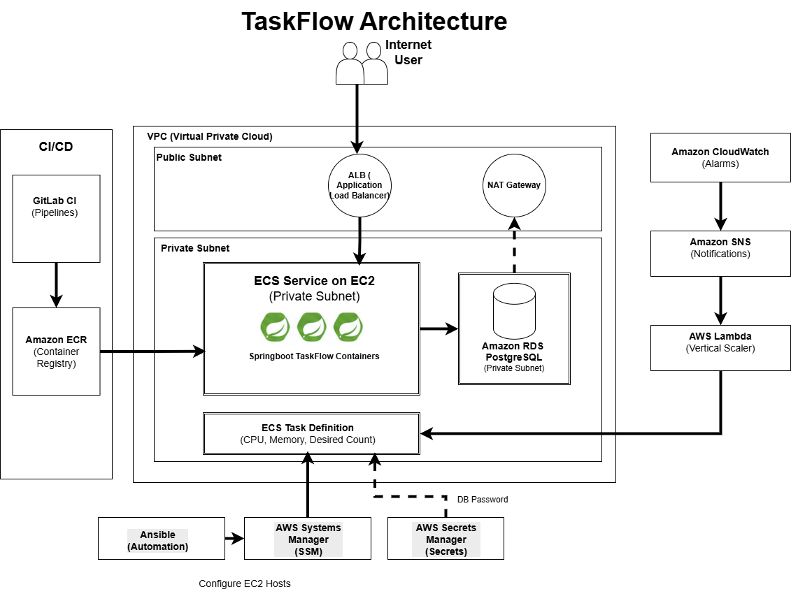

# TaskFlow

An internal task management service, taken from source code to a running, observable, autoscaling AWS deployment.

TaskFlow is a Spring Boot REST API backed by RDS PostgreSQL. It is containerized, provisioned onto ECS-on-EC2 with Terraform, configured with Ansible, and released through a GitLab CI/CD pipeline. The same stack can scale a task **up or down in size** (vertical scaling) and, also change **how many** tasks run (horizontal scaling).


## Architecture at a glance



Users hit an **ALB**. The ALB forwards to **ECS tasks** on EC2 hosts in private subnets. Those tasks talk to **RDS PostgreSQL**. Passwords come from **Secrets Manager**. **GitLab CI** builds images into **ECR** (immutable SHA tags). **CloudWatch → SNS → Lambda** steps task CPU/memory on a ladder when load changes. **Ansible over SSM** keeps the hosts configured without a bastion.

---

## DevOps vs Platform Engineering

These words get mixed together a lot. Here is how they differ, and how this
project sits between them.

**DevOps** is a *way of working*. Developers and operators share responsibility for shipping and running software. The habits matter more than the job title: automate the boring parts, measure what breaks, fix it in the pipeline, and keep feedback loops short. A single engineer doing “dev + ops” on one service is still doing DevOps if they own the path from commit to production.

**Platform Engineering** is a *product mindset* applied to internal tools. A platform team builds paved roads templates, CI, clusters, observability, golden paths so many product teams can ship without each reinventing AWS, Terraform, and security controls. The platform’s customers are other engineers.

| | DevOps (culture) | Platform Engineering (product) |
|---|---|---|
| Goal | Ship *this* service safely and often | Make *many* teams faster with shared tools |
| Typical output | Pipelines, runbooks, alerts for one app | Internal developer platform, modules, standards |
| Success looks like | Fewer failed deploys, faster recovery | Self-service, less ticket ops, consistent defaults |

---

## DevSecOps — security built into the path

Security is not a final checklist after the demo works. It is wired into everyday steps:

1. **Secrets stay out of git.** `.gitignore`, Gitleaks (local hook + CI), and `.env.example` / `*.tfvars.example` patterns keep real keys and passwords off the remote.
2. **Least privilege on AWS.** Separate IAM roles for EC2 instances, task execution, tasks, and the vertical-scaler Lambda. The database password lives in Secrets Manager; ECS reads it at start-up.
3. **Private by default.** App hosts and RDS have no public IPs. Admin access uses SSM, not SSH keys in the repository.
4. **Pipeline gates.** `gitleaks`, Checkov (Terraform), Trivy (image), Spotless, unit/IT coverage (JaCoCo ≥ 70%), and a manual Terraform apply on `main` so infra changes need a human click.
5. **Immutable images.** ECR rejects overwriting tags. Deploys pin a commit SHA so you can say exactly what is running.
6. **Host hygiene.** Ansible enables automatic security updates and disables password SSH; firewalling stays on security groups.

That mix prevent, detect, and reduce blast radius is what people mean by DevSecOps on a small project.

---

## Repository layout

```
.
├── app/                  Spring Boot application (Java 21, Maven)
│   ├── src/main/         Application source
│   ├── src/test/         Unit and integration tests
│   ├── Dockerfile        Multi-stage, layered jar, non-root
│   └── .dockerignore     Keeps build context small
├── lambda/
│   └── vertical_scaler/  Python Lambda that resizes ECS task definitions
├── terraform/
│   ├── bootstrap/        One-time: remote state S3 bucket + DynamoDB lock table
│   ├── modules/          Reusable modules (network, iam, ecr, rds, alb, ecs, monitoring, vertical-scaler)
│   └── envs/prod/        The prod root module that composes them
├── ansible/
│   ├── inventory/        Dynamic AWS inventory (aws_ec2 plugin, tag-based)
│   ├── group_vars/       Shared variables (SSM, cluster name, log group)
│   ├── roles/            common, docker, cloudwatch_agent, ecs_agent
│   ├── site.yml          Entry playbook
│   └── requirements.yml  Ansible Galaxy collections
├── docs/
│   ├── architecture-diagram.png
│   ├── architecture.md
│   ├── runbook.md
│   └── adr/              Architecture Decision Records
├── evidence/             Screenshots and recordings proving the system ran
├── docker-compose.yml    Local app + Postgres stack
├── .gitlab-ci.yml        Nine-stage pipeline (lint → smoke-test)
├── ci/                   Small CI helper scripts
└── README.md
```

Java tests live under `app/src/test/` (Maven standard layout).

## Repository conventions

Secrets never enter git. Three layers enforce this:

- `.gitignore` blocks `*.tfstate`, `*.tfvars`, `.env`, `*.pem`, and private keys, while deliberately allowing `*.tfvars.example` and `.terraform.lock.hcl`.
- `.gitleaks.toml` configures secret scanning (local + CI).
- `.pre-commit-config.yaml` runs gitleaks, `terraform fmt`, yamllint, and private-key detection before a commit is created.

```bash
pip install pre-commit
pre-commit install
```

## Prerequisites

| Tool | Version | Used for |
|---|---|---|
| Java | 21 | Building and running the application |
| Maven | 3.9+ | Build, test, coverage gate (wrapper at `app/mvnw`) |
| Docker | 24+ | Container image build and local Postgres |
| Terraform | 1.9+ | Infrastructure provisioning |
| AWS CLI | 2.x | Credentials, ECS deployment, evidence capture |
| Ansible | 2.16+ | Configuring the ECS host instances |

Ansible needs a Linux control node. On Windows, use WSL.

---

## Reproduce from a clean AWS account

Follow these steps in order on an empty account (Free Tier friendly region `ap-south-1` works well). Expect a few dollars per day while the stack is up (NAT Gateway is the main cost). Destroy when you are done see the runbook.

### 0. Accounts and tools

1. Create an IAM user (or use a sandbox account) with rights to build VPC, ECS, RDS, IAM, ECR, Lambda, CloudWatch, SNS, SSM, Secrets Manager.
2. `aws configure` with region `ap-south-1`.
3. Install Java 21, Maven, Docker, Terraform, AWS CLI.
4. Fork/clone this repo. Copy examples:

```bash
cp .env.example .env                          # local only, never commit
cp terraform/bootstrap/terraform.tfvars.example terraform/bootstrap/terraform.tfvars
cp terraform/envs/prod/terraform.tfvars.example terraform/envs/prod/terraform.tfvars
cp terraform/envs/prod/backend-config.example.hcl terraform/envs/prod/backend-config.hcl
```

Put your **account ID** into the bootstrap bucket name and into `backend-config.hcl`.

### 1. Bootstrap remote state

```bash
cd terraform/bootstrap
terraform init
terraform apply
```

Note the S3 bucket and DynamoDB table names from the outputs.

### 2. Build and push the first image

ECR tags are **immutable**. Use a unique tag (for example `bootstrap1`), not a recycled `latest`.

```bash
cd terraform/envs/prod
# Create only ECR first if you prefer:
# terraform init -backend-config=backend-config.hcl
# terraform apply -target=module.ecr

ECR_URI=<account>.dkr.ecr.ap-south-1.amazonaws.com/taskflow
cd ../../../app
docker build -t taskflow:bootstrap1 .
aws ecr get-login-password --region ap-south-1 \
  | docker login --username AWS --password-stdin "${ECR_URI%/*}"
docker tag taskflow:bootstrap1 "${ECR_URI}:bootstrap1"
docker push "${ECR_URI}:bootstrap1"
```

Set `app_image_tag = "bootstrap1"` in `terraform/envs/prod/terraform.tfvars` for the first apply (CI later switches the running service to git SHAs).

### 3. Apply the prod stack

```bash
cd terraform/envs/prod
terraform init -backend-config=backend-config.hcl
terraform plan
terraform apply
curl "http://$(terraform output -raw alb_dns_name)/health"
```

### 4. Configure hosts with Ansible (WSL)

See the Ansible section below. Run `site.yml` twice and confirm the second run is idempotent (`changed=0`).

### 5. Wire GitLab CI

Create the GitLab project, push `main`, set CI variables (`AWS_*`, `TF_STATE_BUCKET`, `TF_LOCK_TABLE`, `SSM_S3_BUCKET`). Open a merge request to see lint → plan; merge to `main` and use the **manual** apply when you intend to change infrastructure. App-only changes still build, push a new SHA, and roll ECS in the deploy stage.

### 6. Prove it

- CRUD via Postman collection `docs/taskflow.postman_collection.json`
- Vertical scale: invoke the Lambda with `{"direction":"up"}` (runbook)

### 7. Tear down

```bash
cd terraform/envs/prod
terraform destroy
# Empty/delete ECR images if needed, then destroy bootstrap if finished
```

---

## Running locally

### Option A — Docker Compose (recommended)

```bash
docker compose up --build -d
curl http://localhost:8080/health
docker compose down
```

Compose publishes Postgres on host port **5433** so it does not collide with a native PostgreSQL on 5432. Inside the Compose network the app uses `db:5432`.

The image is multi-stage: Maven builds a layered jar; a JRE Alpine runtime runs as UID 10001 with an exec-form entrypoint for graceful shutdown.

### Option B — Maven on the host

```bash
docker run -d --name taskflow-local-db \
  -e POSTGRES_DB=taskflow \
  -e POSTGRES_USER=taskflow \
  -e POSTGRES_PASSWORD=taskflow_local \
  -p 5433:5432 postgres:16-alpine

cd app && mvn spring-boot:run
```

Host `spring-boot:run` uses the `local` profile (`DB_PORT` 5433). Compose and ECS set `DB_HOST` / `DB_PORT` explicitly instead.

### Endpoints

| Endpoint | Purpose |
|---|---|
| `/health`, `/health/liveness`, `/health/readiness` | Actuator health probes |
| `/info`, `/metrics` | Build metadata and metrics |
| `/api/v1/tasks` | Task CRUD |
| `/swagger-ui.html`, `/v3/api-docs` | API docs |

```bash
cd app && mvn verify
```

---

## Terraform

| Module | What it creates |
|---|---|
| `network` | VPC, public/private subnets, NAT gateway |
| `iam` | ECS instance profile, task execution + task roles |
| `ecr` | Container registry (immutable tags) |
| `rds` | PostgreSQL + Secrets Manager credentials |
| `alb` | Internet-facing load balancer → `/health` |
| `ecs-cluster` | ECS-on-EC2 ASG, capacity provider |
| `ecs-service` | Task definition, service, optional horizontal autoscaling |
| `monitoring` | Log group + CPU/memory alarms → SNS |
| `vertical-scaler` | Lambda that steps task CPU/memory |

**Vertical:** alarm → SNS → Lambda ladder (`256/512` → `512/1024` → `1024/2048`).  
**Horizontal (bonus):** target tracking near ~60% CPU, desired count 1–2.

```bash
aws lambda invoke \
  --function-name $(terraform output -raw vertical_scaler_function_name) \
  --payload '{"direction":"up"}' \
  out.json && cat out.json
```

---

## Ansible

Hosts are private; Ansible uses **SSM**. Inventory selects tags `Project=taskflow` and `Role=ecs-host`. Amazon Linux 2023 uses `dnf-automatic` for security updates. Keep **firewalld off** it fights Docker’s iptables on ECS hosts. Network filtering stays on security groups.

### One-time setup (Ubuntu WSL)

```bash
sudo apt update
sudo apt install -y python3-pip python3-venv unzip curl
python3 -m venv ~/ansible-venv
source ~/ansible-venv/bin/activate
pip install "ansible>=9" boto3 botocore

cp -a "/mnt/c/Users/Admin/Desktop/Platform Engineer Assignment/taskflow/ansible" ~/taskflow-ansible
cd ~/taskflow-ansible
ansible-galaxy collection install -r requirements.yml

curl -s "https://s3.amazonaws.com/session-manager-downloads/plugin/latest/ubuntu_64bit/session-manager-plugin.deb" -o /tmp/session-manager-plugin.deb
sudo dpkg -i /tmp/session-manager-plugin.deb
```

Export the same AWS credentials used for Terraform.

### Run twice (idempotent)

```bash
source ~/ansible-venv/bin/activate
cd ~/taskflow-ansible
ansible-inventory --graph
ansible-playbook site.yml -e ssm_s3_bucket=taskflow-tfstate-YOUR_ACCOUNT_ID
ansible-playbook site.yml -e ssm_s3_bucket=taskflow-tfstate-YOUR_ACCOUNT_ID
```

| Role | What it does |
|---|---|
| `common` | Security updates, harden SSH, keep firewalld off |
| `docker` | Docker installed and running |
| `ecs_agent` | `/etc/ecs/ecs.config` + agent running |
| `cloudwatch_agent` | Ship host/ECS logs to CloudWatch |

---

## GitLab CI/CD

Pipeline: [`.gitlab-ci.yml`](.gitlab-ci.yml).

| Stage | What it does | When |
|---|---|---|
| `lint` | terraform fmt/validate, tflint, ansible-lint, spotless, yamllint | MR + main |
| `security` | gitleaks, checkov, trivy image | MR + main |
| `test` | `mvn verify` (JaCoCo 70% gate) | MR + main |
| `build` | Docker build; push immutable `:SHA` on main | MR + main |
| `plan` | `terraform plan` artifact | MR + main |
| `apply` | `terraform apply` — **manual** | main only |
| `configure` | Ansible over SSM | after apply |
| `deploy` | New task definition → SHA image | after configure |
| `smoke-test` | ALB `/health` until HTTP 200 | after deploy |

### CI/CD variables

GitLab → Settings → CI/CD → Variables:

| Key | Example | Flags |
|---|---|---|
| `AWS_ACCESS_KEY_ID` | your key | Masked |
| `AWS_SECRET_ACCESS_KEY` | your secret | Masked |
| `AWS_DEFAULT_REGION` | `ap-south-1` | |
| `TF_STATE_BUCKET` | `taskflow-tfstate-467640460026` | |
| `TF_LOCK_TABLE` | `taskflow-terraform-locks` | |
| `SSM_S3_BUCKET` | same as state bucket | |

Leave **Protected** unchecked on AWS keys if MR `plan` jobs should see them.
Keep them **Masked**. Apply stays manual on `main`.

GitHub can mirror the same commits; runners execute on GitLab.

---

## Operations

Day-to-day deploy, rollback, scaling, and incident steps live in
**[docs/runbook.md](docs/runbook.md)**.

Design choices are recorded as ADRs under **[docs/adr/](docs/adr/)**.
