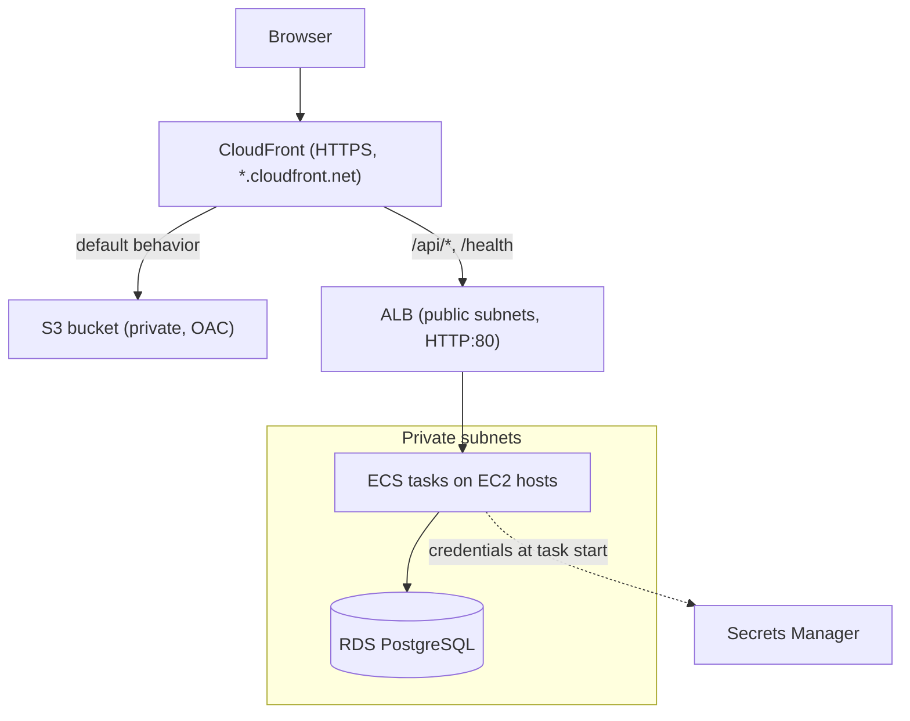
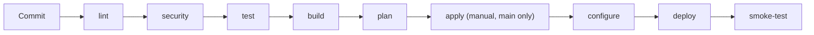

# TaskFlow architecture

How the pieces fit together, and why each one is there. The picture version is
[architecture-diagram.png](architecture-diagram.png); this document is the written form, including
the parts a diagram cannot carry.

## Request path

A request for the user interface is served from a private S3 bucket that only CloudFront can read.
A request for `/api/v1/...` goes through the same CloudFront distribution to a second origin, the
load balancer. Because both are the same CloudFront domain, the browser treats the API as
same-origin: no CORS preflights, no mixed-content blocking, and one HTTPS certificate covers both.
See [adr/008-frontend-s3-cloudfront.md](adr/008-frontend-s3-cloudfront.md) for why this shape was
chosen over an HTTPS listener on the load balancer.

The load balancer lives in the public subnets and is the only thing with a route to the internet
gateway. Everything that holds state or runs code sits in private subnets and reaches the internet
outbound-only, through a NAT gateway, for image pulls and SSM.

## Network

Two availability zones, because both the ALB and the RDS subnet group require at least two.

- Public subnets `10.0.1.0/24` and `10.0.2.0/24`: load balancer and NAT gateway
- Private subnets `10.0.11.0/24` and `10.0.12.0/24`: ECS container instances and RDS
- One NAT gateway, shared. It is the single largest line item in the bill, and a second one would
  buy AZ-failure redundancy that a demo stack does not need.
- The VPC default security group has its rules stripped, so nothing can accidentally land in an
  allow-all group.

Security groups chain rather than using CIDRs: the ECS host group accepts traffic only from the ALB
group on the ephemeral port range `32768-65535`, and the database group accepts traffic only from
the ECS host group on `5432`. Nothing in the data path trusts an IP range.

## Compute

ECS on EC2, not Fargate, so that Ansible has real hosts to configure. The reasoning is in
[adr/001-ecs-on-ec2.md](adr/001-ecs-on-ec2.md).

An Auto Scaling Group of ECS-optimized Amazon Linux 2023 instances registers into the cluster
through a capacity provider. Tasks use `bridge` networking with `hostPort = 0`, so the ECS agent
picks a dynamic host port and more than one task can share a host. The load balancer finds them
because the target group registers by instance and port rather than by IP.

Terraform provisions the hosts; Ansible configures them. That split is deliberate and is what the
`configure` stage in the pipeline exists to demonstrate. Ansible reaches the hosts over SSM using a
tag-based dynamic inventory, so there is no bastion, no key material in the repository, and no
inventory file to keep up to date. See [adr/003-ansible-over-ssm.md](adr/003-ansible-over-ssm.md).

## Data

RDS PostgreSQL in the private subnets, single-AZ, encrypted at rest, not publicly accessible.

Terraform generates the password with `random_password`, writes it to Secrets Manager, and never
puts it in an environment variable. The ECS task definition references the secret by ARN with a
JSON key selector (`:username::` and `:password::`), so the ECS *task execution role* resolves it
at task start and the value never appears in the task definition, in Terraform state output, or in
the container's environment listing. See [adr/006-secrets-manager-db.md](adr/006-secrets-manager-db.md).

Flyway owns the schema. The application runs with `ddl-auto=validate`, which turns a mismatch
between a JPA entity and the migrations into a startup failure rather than a silent `ALTER TABLE`
against a production table.

## Application

A Spring Boot service whose configuration is read entirely from environment variables. The defaults
baked into `application.yml` are local development values so that `docker compose up` works with no
setup; in AWS, Terraform injects the real ones.

Three health endpoints, each with a different consumer:

- `/health` - the aggregate, used by the ALB target group
- `/health/liveness` - deliberately excludes the database, used by the container health check. If
  liveness depended on the database, a brief RDS outage would fail every container at once and ECS
  would restart the entire service while the database was already struggling.
- `/health/readiness` - includes the database, because readiness gates traffic

Shutdown is graceful: the server stops accepting connections, lets in-flight requests finish, then
closes the connection pool. `SHUTDOWN_TIMEOUT` is held below the ECS `stopTimeout` so ECS does not
`SIGKILL` the container mid-drain. This is what keeps rolling deployments and vertical-scaling
redeployments from dropping traffic.

Logs are structured JSON on stdout, which the `awslogs` driver ships to CloudWatch without any
parsing rules. A correlation-ID filter puts a request identifier into every line of a request, so
one slow or failing call can be followed end to end.

## Scaling

Two mechanisms that answer different questions.

**Vertical** - "each task needs to be bigger." A CloudWatch alarm on service CPU or memory
publishes to SNS, which invokes a Lambda. The Lambda reads the running task definition, finds its
position on a ladder (`256/512` then `512/1024` then `1024/2048`), registers a copy at the next rung
and forces a new deployment. Alarm names ending `-high` step up, `-low` step down, and the function
no-ops at either end of the ladder. It has `reserved_concurrent_executions = 1` so a CPU alarm and a
memory alarm firing seconds apart cannot both read the same current size and skip a rung. See
[adr/004-vertical-scaling-lambda.md](adr/004-vertical-scaling-lambda.md).

**Horizontal** - "we need more tasks." Application Auto Scaling target tracking holds average CPU
near 60% by changing the desired count.

Both write to the live service, which is why `aws_ecs_service` declares
`ignore_changes = [task_definition, desired_count]`. Without it, the next `terraform apply` would
revert whatever the scaler and the autoscaler had just done.

## Delivery path

Merge requests run `lint` through `plan` and stop. Only the default branch can reach `apply`, and
only behind a manual click. Images are tagged with the commit SHA and pushed to a repository with
immutable tags, so a given tag always means exactly one artifact and a rollback is "point at an
older SHA" rather than "rebuild and hope". See
[adr/005-immutable-ecr-tags.md](adr/005-immutable-ecr-tags.md).

Terraform state lives in S3 with a DynamoDB lock table, created by a separate `bootstrap` stack so
the state backend is not stored in the state it manages. See
[adr/002-terraform-remote-state.md](adr/002-terraform-remote-state.md).

## Observability

- Application and host logs in CloudWatch Logs with an explicit 14-day retention
- A dashboard covering request latency percentiles, request and error counts, task utilisation
  against the scaling thresholds, healthy target count, and a live tail of recent error logs
- Alarms on CPU and memory that drive vertical scaling, plus alarms on ALB 5xx rate and p99 latency
  that indicate the service is unhealthy rather than merely busy

## What this deliberately does not have

Worth stating, so the gaps read as decisions rather than oversights: no custom domain or ACM
certificate on the load balancer, no WAF, no VPC flow logs, no Multi-AZ database, no
customer-managed KMS keys, and no cross-region anything. Each is a cost tradeoff for a stack that
exists to be demonstrated and torn down; the accepted security findings and the reason for each are
listed in [.checkov.yaml](../.checkov.yaml).
